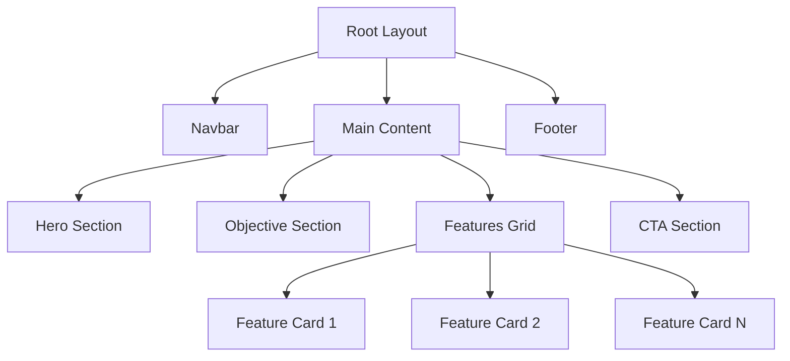

# Landing Page Design Specification

This document outlines the architecture, content, and component mapping for the IOE Student Utils landing page.

## 1. Visual Style & Design System

Based on the project's [`src/styles/globals.css`](src/styles/globals.css) and [`package.json`](package.json):

- **Framework**: Next.js 16 (App Router) + Tailwind CSS 4.
- **UI Library**: Shadcn UI (Radix UI primitives).
- **Color Palette**:
  - **Primary**: `oklch(0.6 0.13 163)` (A teal/greenish hue, representing growth and academia).
  - **Background**: `oklch(1 0 0)` (White) / `oklch(0.13 0.028 261.692)` (Dark).
  - **Accent**: Matches Primary.
- **Typography**:
  - **Sans**: `var(--font-sans)` (Geist or similar modern sans-serif).
  - **Mono**: `var(--font-geist-mono)`.
- **Icons**: Lucide React.

## 2. Section-by-Section Content

### 2.1 Navigation Bar

- **Logo**: IOE Student Utils (Icon + Text).
- **Links**: Features, About, Community, Docs.
- **Actions**: "Sign In" button, "Get Started" (Primary).

### 2.2 Hero Section

- **Headline**: Bridge the Gap Between IOE and Global Standards.
- **Sub-headline**: The ultimate open-source toolkit for Institute of Engineering students to navigate their academic journey and transition to international education.
- **Primary CTA**: "Get Started" (Redirects to Dashboard/Sign-up).
- **Secondary CTA**: "View on GitHub" (Social proof/Open source focus).
- **Visual**: Abstract representation of a bridge or a dashboard mockup.

### 2.3 Objective Section

- **Title**: Our Mission.
- **Content**: "IOE Student Utils is a community-driven ecosystem designed to assist students and graduates in their academic journey. We provide essential tools and resources to simplify the process of applying to universities abroad and meeting international academic standards."
- **Key Pillars**: Open Source, Community Driven, Student Centric.

### 2.4 Features Grid

Showcase planned features using a responsive grid of cards.

| Feature                  | Icon            | Description                                                          |
| ------------------------ | --------------- | -------------------------------------------------------------------- |
| **University Finder**    | `Search`        | Find universities accepting TU credits and their requirements.       |
| **GPA Calculator**       | `Calculator`    | Convert TU percentage to US 4.0 GPA using WES/Scholaro logic.        |
| **Scholarship Database** | `GraduationCap` | Explore global scholarships for international students.              |
| **Resume Builder**       | `FileText`      | Create professional resumes tailored for international applications. |
| **Credit Calculator**    | `Clock`         | Convert TU hours (L-T-P) to standard international credits.          |
| **Syllabus Explorer**    | `BookOpen`      | Detailed breakdown of BCT subjects and marks distribution.           |

### 2.5 Call to Action (CTA)

- **Headline**: Ready to take the next step?
- **Sub-headline**: Join our growing community of students and contributors.
- **Buttons**: "Join Community", "Contribute on GitHub".

### 2.6 Footer

- **Links**:
  - **Project**: About, Roadmap, License.
  - **Resources**: Documentation, API Docs.
  - **Social**: GitHub, Discord/Telegram.
- **Copyright**: © 2026 IOE Student Utils. MIT Licensed.

## 3. Component Mapping (Shadcn UI)

| Section           | Shadcn UI Components                                 |
| ----------------- | ---------------------------------------------------- |
| **Navigation**    | `NavigationMenu`, `Button`, `Avatar` (if logged in)  |
| **Hero**          | `Button`, `Badge` (for "New" or "Open Source" tag)   |
| **Objective**     | `Card`, `Separator`                                  |
| **Features Grid** | `Card`, `CardHeader`, `CardTitle`, `CardDescription` |
| **CTA Section**   | `Button`, `Input` (for newsletter if added)          |
| **Footer**        | `Separator`                                          |
| **General**       | `Tooltip` (for icon labels), `Sonner` (for feedback) |

## 4. Layout Architecture

