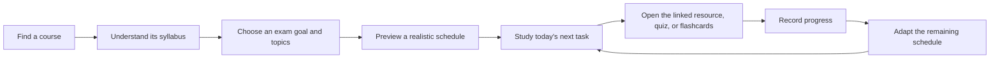
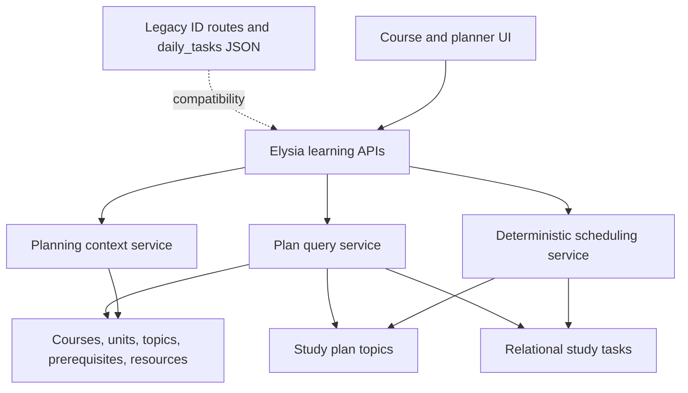

# Study Planner and Course Explorer Learning Workspace Revamp

**Date:** 2026-07-12  
**Status:** Proposed  
**Scope:** Planning and architecture only  
**Primary surfaces:** `/study-planner`, `/dashboard/study-plans/[slug]`, `/course-explorer`, `/course-explorer/[slug]`

## Executive decision

Do not rebuild the Study Planner as a prettier template form. Reframe Study Planner and Course Explorer as two views of one learning workflow:



Course Explorer remains useful by itself, and Study Planner continues to support a manual plan, but course-backed planning becomes the primary path. Internal UUIDs remain as database keys. Stable slugs become the canonical user-facing route and mutation boundary.

The first release should make three things undeniably work:

1. A new student can understand the feature from the empty state.
2. A student can turn an existing IOE course into a useful plan without retyping its syllabus.
3. Today's tasks can be completed, linked back to course topics, and safely rescheduled.

## Evidence reviewed

This proposal was checked against the current repository, not only the historical checklists:

- `docs/study-planner.md`
- `docs/plans/2026-01-31-study-planner-design.md`
- `docs/plans/2026-01-31-study-planner-implementation.md`
- `docs/plans/2026-02-01-course-explorer-design.md`
- `docs/plans/2026-02-09-dynamic-study-plan-detail-page.md`
- `src/components/study-planner/*`
- `src/components/course-explorer/*`
- `src/server/elysia/routes/study-plans.ts`
- `src/server/elysia/routes/study-tasks.ts`
- `src/server/elysia/routes/course-explorer.ts`
- `src/server/utils/study-plan-generator.ts`
- `src/server/db/schema/study-planners.ts`
- Course, unit, topic, prerequisite, and resource-link schemas
- Current seeders, migrations, and `test/specs/study-plans.spec.ts`
- The supplied empty-state screenshot at `localhost:3000/study-planner`

The development database was not reachable during this review (`ECONNREFUSED`). Repository evidence still confirms that the study-template seeder only creates templates, is not called by the main seeder, and creates no example user plan.

### Relationship to the companion Course Explorer plan

The existing `docs/plans/2026-07-12-course-explorer-revamp.md` was reviewed and left unchanged. It contains a deeper Course Explorer route, catalog, canonical-course-slug, and outline-first analysis. Use that document for Course Explorer-specific implementation detail and this document for the end-to-end learning loop, Study Planner redesign, shared data boundaries, development fixture, and rollout order. The two plans agree that the ordered syllabus is primary, the graph is optional, slugs are user-facing aliases rather than replacement primary keys, and the current planner handoff must become functional.

## Self-critical review of the original work

### What the original design got right

| Decision | Why it remains valuable | Keep or adapt |
| --- | --- | --- |
| Day-by-day, completable work | Students need an answer to “what should I do now?” | Keep, but schedule by real date as well as day number |
| Learn, practice, review, and prepare task modes | The task vocabulary supports a balanced study cycle | Keep as validated task kinds |
| Preview and customize before activation | A generated plan should be inspectable and editable | Restore this, because it was planned but not implemented |
| Optional time logging | Completion must remain fast while allowing richer reflection | Keep optional and inline |
| Behind-schedule recovery | Missed work is normal during exam preparation | Promote to a core workflow, not a later smart feature |
| Templates for common durations | Presets reduce setup decisions | Retain as scheduling profiles, not rigid content generators |
| Edge-case thinking | Exam-date changes, missed days, conflicts, and early completion were considered | Turn the highest-frequency cases into acceptance tests |
| Measurable outcomes | Adoption, completion, retention, and time to first plan are useful | Replace vanity progress with activation and task-success metrics |

### Missed opportunities

1. **The course model was treated as optional context.** The planner asks students to type a subject and every topic manually even though Course Explorer already stores courses, units, ordered topics, prerequisites, estimated hours, weightage, priority, and resources.
2. **The two tools were intentionally decoupled at the experience layer.** Decoupled services are healthy, but the student workflow should be continuous. The current “Create Study Plan” link passes `?course={slug}`, while the planner ignores the parameter.
3. **The plan centered duration templates instead of student capacity.** “One week” is not a workload. A useful plan needs exam date, available minutes by day, known or skipped topics, and a target such as passing, exam preparation, or full coverage.
4. **The original preview step disappeared during implementation.** Students cannot see workload, empty days, topic ordering, or date conflicts until after creation.
5. **LMS-like follow-through was deferred.** Tasks do not open their topic, primary resource, practice material, quiz, or flashcards. The planner tracks completion without helping the student learn.
6. **The empty state became promotional rather than instructional.** It promises a “success story” and “mastery” but does not show what a plan contains, how long setup takes, or how Course Explorer helps.
7. **The course graph became the default experience.** A graph is useful for relationships, but an ordered syllabus is easier to scan, navigate with a keyboard, and use on mobile. The plan mentioned a tree alternative, but it was not implemented.
8. **Seed design stopped at reference data.** Templates exist as generic configuration, but there is no realistic active plan with completed, missed, current, and upcoming tasks for user testing.

### Mistakes and implementation drift

#### P0: Today-task completion can target records that do not exist

`generateStudyPlan` creates UUIDs inside `study_plans.daily_tasks`. The create route inserts rows into `study_tasks` without preserving those UUIDs. `/study-plans/today` reads the JSON UUIDs and sends them to `/study-tasks/:id/complete`, which looks up the relational task row. This makes the two sources disagree.

The current test suite hides the defect because it tests a hand-built mock Elysia application that does preserve task IDs. It does not import and exercise the production routes.

**Correction:** make `study_tasks` the source of truth, preserve IDs during the transition, and add integration tests against the real route modules and a test database.

#### P0: Dashboard data is not trustworthy

- “Tasks Today” is derived from `floor(progressPercentage / 10)` instead of today's tasks.
- The `+12%` and `+5%` trends are hard-coded.
- The daily streak is hard-coded to three days.
- “On Track” is inferred from total completion greater than or equal to 80%, regardless of elapsed schedule time.

**Correction:** remove every unsupported metric. Derive today count, overdue count, scheduled workload, pace, and streak from dated task records or do not display them.

#### P1: The generator does not implement its own model

- `difficulty` is accepted but ignored.
- `dailyHoursAvailable` is reserved but ignored.
- `intensityCurve` is stored but ignored.
- `examDate` is only used for validation.
- Prerequisites, course ordering, topic hours, weightage, and priority are ignored.
- Placeholder values such as five problems and ten key terms are fixed.
- `ceil(topics / days)` can create multiple empty days and does not reserve review or buffer time.

**Correction:** replace placeholder expansion with a deterministic, capacity-aware scheduler built from course topics and scheduling profiles.

#### P1: Two sources of truth create permanent drift

`study_plans.daily_tasks` and `study_tasks` represent the same schedule differently. Completion, notes, logged time, rescheduling, and future resource links live only on relational tasks, while today's query reads JSON.

**Correction:** relational tasks become authoritative. Keep `daily_tasks` as a legacy snapshot during migration, then stop writing it after all old plans are backfilled and dual-read telemetry is clean.

#### P1: The creation flow cannot protect the student from a bad plan

- Course and topics must be entered manually.
- Template suitability is not explained before selection.
- The UI does not disable templates that exceed the days before the exam.
- There is no daily availability input.
- There is no preview, workload summary, or conflict warning.
- Success waits two seconds and returns to the dashboard instead of opening the plan.

**Correction:** use a short, inline three-step flow with an editable preview and a direct transition into the first task.

#### P1: The detail page is a report, not a workspace

It renders every day and every task as static cards. It does not provide task completion, notes, resource access, rescheduling, or a strong “today” position. This was already recognized in the February follow-up plan but remains unimplemented.

**Correction:** default to Today, with Plan, Progress, and Resources as secondary views. Keep completion and rescheduling inline.

#### P2: Visual treatment competes with the work

The current planner and course landing page rely on decorative gradients, gradient text, background glows, glass-like cards, animated metrics, large empty areas, and repeated card grids. These patterns reduce scanability and conflict with the product's practical, student-led character.

**Correction:** use a restrained product interface, semantic tokens, solid text colors, familiar controls, purposeful state motion, and fewer containers.

#### P2: Slugs are only partially adopted

Course, unit, topic, and study-plan pages have slugs, but:

- Study-plan slugs are globally unique, so one user's plan can force another user's unrelated suffix.
- Older ID endpoints remain the main mutation contract.
- The `/:id` route summary incorrectly describes a slug lookup.
- Templates have no readable slug.
- Tasks have no stable key within a plan.

**Correction:** keep UUIDs internal and add canonical, user-scoped slug routes. Existing ID routes remain compatibility aliases.

#### P2: The seed and test strategy does not support product testing

- The study-template seeder exits as a standalone process and is not composed into `seed.ts`.
- It skips all work when any template exists, so it cannot add new presets safely.
- It creates no example plan, tasks, logs, missed day, or academic event.
- API tests duplicate route logic in memory and therefore validate the mock instead of production behavior.

**Correction:** export idempotent seed functions, add a user-targeted development fixture, and test real routes with controlled time.

## Product definition

### Primary users and jobs

1. **First-time planner:** “I have an exam coming up. Turn the official syllabus into a plan I can actually follow.”
2. **Rushed returning student:** “Tell me the next useful task I can finish in the time I have today.”
3. **Behind-schedule student:** “Help me recover without silently creating an impossible workload.”
4. **Independent explorer:** “Let me understand the course, topic order, and useful resources before I commit to a plan.”

### Product promise

> Choose a course and exam goal. IOESU turns the syllabus into a realistic schedule, keeps today's work clear, and connects every task to something useful to study or practice.

### Success metrics

| Metric | Definition | Initial target |
| --- | --- | --- |
| Time to useful preview | From planner entry to a generated preview | Median under 90 seconds |
| Preview activation | Previewed plans that are activated | At least 60% |
| First-task success | Activated plans with one completed task in 24 hours | At least 50% |
| Course-backed plans | New plans linked to an existing course | At least 70% where course data exists |
| Recovery success | Rebalanced plans with a task completed in the next 48 hours | At least 40% |
| Task mutation reliability | Completion or reschedule requests that persist correctly | 99.9% |
| Empty-state comprehension | Testers who can explain the workflow without help | 4 of 5 moderated testers |

Do not ship fabricated trends, mastery, streaks, or schedule status before the underlying data exists.

## Experience and visual direction

### Scene sentence

An IOE student uses a phone or laptop in a bright classroom, library, or shared room between commitments, often anxious about an approaching exam and needing the next decision to be obvious.

This calls for a light-first, restrained product surface with full dark-mode support. Accent color is reserved for the current selection, primary action, focus, and progress state. The surface should feel like a dependable syllabus and task tool, not a promotional dashboard.

### Design rules

- Use existing semantic Tailwind tokens. Formalize the current system in `DESIGN.md` before high-fidelity implementation.
- Use solid foreground text. Do not use gradient text.
- Remove decorative star fields, ambient glow orbs, fake glass, and ornamental page-load sequences.
- Use cards only where a bounded object needs independent actions. Prefer sections, rows, dividers, and an academic outline.
- Motion lasts 150 to 250 ms and communicates state change only.
- Keep body copy within 65 to 75 characters per line.
- Meet WCAG 2.2 AA, keyboard navigation, reduced motion, 200% zoom, and screen-reader expectations.
- Never rely on graph position or color alone. Every map has an equivalent ordered outline.

### Information architecture

#### Course Explorer landing

Replace the oversized hero and decorative metrics with:

1. Page title and one sentence explaining the task.
2. Search by course name, code, program, or topic.
3. Optional program and semester filters.
4. A compact results list grouped by program or semester.
5. Recent or active courses for signed-in students.

The primary action is “Open course”. “Plan this course” is a secondary action on each result.

#### Course workspace

Default route remains `/course-explorer/[courseSlug]`.

```text
Course header: name, code, credits, progress, Plan this course
Tabs: Overview | Syllabus | Resources | Map

Syllabus default:
  Left or top: ordered units and topics
  Main: selected topic, prerequisites, outcomes, estimated time
  Actions: Mark understood, Add to plan, Open primary resource
```

- The syllabus outline is the default because it matches how students recognize course structure.
- Map view remains available when relationships provide value.
- Resources are filtered by selected topic and relevance.
- Quiz and flashcard links appear only when real linked content exists.
- Mobile uses one pane with a syllabus drawer. It never preserves fixed 256 px and 384 px sidebars around a squeezed graph.

#### Planner home

Default route remains `/study-planner`.

Order the page by urgency and usefulness:

1. **Today:** available minutes, due tasks, overdue tasks, and one clear “Continue” action.
2. **Upcoming:** the next seven days in a compact agenda.
3. **Plans:** active, paused, completed, and archived plans.
4. **Create:** “Plan a course” as primary and “Create a manual plan” as secondary.

Remove top-level metric cards unless a metric changes today's decision.

##### First-time state

The empty state teaches through a concrete example:

- Heading: “Turn a course syllabus into a daily plan.”
- Three-step preview: Choose Data Structures, set the exam date, review today's tasks.
- Primary action: “Try the Data Structures example”.
- Secondary action: “Browse courses”.
- Tertiary action: “Create a manual plan”.

The example may be instantiated for the current development user or previewed without persistence. It must not show invented progress.

#### Plan creation

Use an inline route or full-page stepper, not a modal.

**Step 1: Choose what to study**

- If entered from Course Explorer, load `courseSlug` and its syllabus automatically.
- If entered from Planner, search existing courses first.
- Offer manual subject and topic entry as a fallback.
- Show units and topics as an ordered checklist with “core”, “important”, estimated hours, and prerequisite context.
- Allow “I already know this” and “Skip for this exam”.

**Step 2: Set the constraint**

- Exam date or target date.
- Goal: minimum passing, exam preparation, or full coverage.
- Available minutes by weekday, with a simple uniform default.
- Rest days and earliest start date.
- Optional preferred session length.

**Step 3: Review the plan**

- Show total available time versus estimated work.
- Show the first seven days, task mix, buffer days, and exam-eve policy.
- Explain any compromise in plain language.
- Allow topic, day, and daily-capacity adjustments before activation.
- Disable activation only for actionable errors. Warnings may be accepted explicitly.

After activation, navigate directly to `/study-planner/[planSlug]` and focus the first task.

#### Active plan workspace

Add canonical `/study-planner/[planSlug]`. Keep `/dashboard/study-plans/[slug]` working and redirect or render the same workspace.

Tabs:

- **Today:** current, overdue, and completed-today tasks.
- **Plan:** dated agenda grouped by week, with collapsed future weeks.
- **Progress:** topic coverage and pace based on scheduled versus completed work.
- **Resources:** course resources grouped by the topics in this plan.

Each task row includes:

- Checkbox or status control.
- Clear action and topic name.
- Estimated time.
- Linked course topic.
- One primary resource or practice action when available.
- Inline notes and “Move” action behind progressive disclosure.

Completion must be optimistic with rollback and an accessible status announcement. Celebration is brief and limited to meaningful milestones.

#### Recovery flow

When tasks are missed, show a calm inline prompt:

> Two tasks are overdue (70 minutes). Rebalance them across the next four available days?

Actions:

- Rebalance automatically.
- Review changes.
- Keep current dates.
- Drop low-priority work.

Always preview the effect before changing future dates. Preserve completed tasks and user notes.

## Target architecture

### Boundary principle

The database may use UUIDs and text IDs internally. A student should see course, topic, template, plan, and task slugs at navigation and action boundaries.



### Data model changes

Use expand and contract migrations. New fields are nullable until backfill is verified.

#### `study_templates`

Add:

- `slug varchar(120)` with a unique index after backfill.
- `description text` for student-facing selection guidance.
- `planning_mode varchar(50)` such as `exam-prep`, `minimum`, or `full-coverage`.
- `version integer default 1`.

Keep `daily_structure` and `intensity_curve` for compatibility. New scheduling profiles should interpret them explicitly or replace them with versioned rules in application code.

#### `study_plans`

Add:

- `course_id text null` referencing `academic_course.id`.
- `academic_event_id uuid null` referencing `academic_event.id`.
- `goal varchar(50) null`.
- `daily_minutes integer null` as a simple default.
- `availability jsonb null` for weekday-specific capacity and rest days.
- `schedule_version integer not null default 1`.
- `generation_input jsonb null` containing the accepted preview inputs and warnings.
- `last_rebalanced_at timestamp null`.

Change slug uniqueness from global to `(user_id, slug)`. Keep current slug values. All slug lookups must include the authenticated user.

Keep `daily_tasks` during migration, but mark it deprecated. It must never override relational task state.

#### New `study_plan_topics`

Create an explicit plan-to-topic selection table:

```text
id uuid primary key
study_plan_id uuid foreign key
course_topic_id text foreign key
position integer
included boolean
selection_reason varchar
estimated_minutes integer
mastery_status varchar
created_at timestamp
updated_at timestamp
unique (study_plan_id, course_topic_id)
```

This preserves the student's selected syllabus, supports topic-level progress, and prevents generated task titles from becoming the only link back to curriculum data.

#### `study_tasks`

Add:

- `slug varchar(160) null`, later required with unique `(study_plan_id, slug)`.
- `course_topic_id text null` referencing `course_topic.id`.
- `scheduled_date date null`.
- `position integer not null default 0`.
- `origin varchar(50) null`, such as generated, manual, or rebalanced.
- `available_after timestamp null` if time-of-day release is later required.

Keep UUID `id` as the primary key. During the compatibility phase, preserve the generated UUID when inserting a relational task so old `daily_tasks` references continue to work.

Do not copy resources into task JSON. Resolve topic resources through `course_topic_id`. Add a task-resource join only if students need task-specific attachments that differ from the topic's curated resources.

### Migration sequence

1. Add nullable columns, indexes, and `study_plan_topics`.
2. Add template slugs and task slugs with deterministic, collision-safe backfills.
3. Backfill `scheduled_date` from plan start date plus day number.
4. Reconcile legacy JSON task IDs with relational rows using plan, day, title, type, and position. Log ambiguous matches for manual review.
5. Update writers to preserve IDs and write both representations temporarily.
6. Update readers so `study_tasks` is authoritative, with legacy JSON fallback only when relational tasks are absent.
7. Record fallback usage. Stop legacy JSON writes only after fallback reaches zero in development and staging fixtures.
8. Keep the JSON column and old endpoints for at least one stable release. Removal is a separate, explicitly approved migration.

### API evolution

Keep all current routes during the migration:

- `GET /study-plans`
- `POST /study-plans/create`
- `GET /study-plans/:id`
- `PATCH /study-plans/:id`
- `DELETE /study-plans/:id`
- Existing task ID routes

Correct their implementation and document them as compatibility endpoints.

Add canonical endpoints:

| Method | Endpoint | Purpose |
| --- | --- | --- |
| GET | `/course-explorer/courses/slug/:slug/planning-context` | Ordered topics, prerequisites, estimates, weightage, and resource availability |
| POST | `/study-plans/preview` | Validate inputs and return an editable, non-persisted schedule |
| POST | `/study-plans` | Activate an accepted preview |
| GET | `/study-plans/slug/:slug/workspace` | Plan, dated tasks, topic context, and summary for a requested date |
| PATCH | `/study-plans/slug/:planSlug/tasks/:taskSlug` | Complete, uncomplete, move, or edit a task |
| POST | `/study-plans/slug/:slug/rebalance/preview` | Preview recovery changes |
| POST | `/study-plans/slug/:slug/rebalance` | Apply an accepted recovery preview |

Every response follows `{ success, data?, error? }`. Every write uses the authenticated user from the authorization plugin. Do not accept `userId` from the client.

The preview response should include:

- Stable draft task keys.
- Scheduled dates and positions.
- Topic slug and task kind.
- Estimated minutes.
- Linked resource availability.
- Capacity by day.
- Warnings and plain-language rationale.
- A `scheduleVersion` used to reject stale activation requests.

### Scheduling service

Replace direct placeholder expansion with a pure, deterministic scheduler that accepts a clock and can be unit tested.

#### Inputs

- Course and ordered selected topics.
- Strong and weak prerequisites.
- Topic hours, priority, and exam weightage.
- Student goal and known or skipped topics.
- Start date, exam date, weekday availability, rest days, and session length.
- Scheduling profile version.

#### Algorithm

1. Validate date range, total capacity, and topic selection.
2. Topologically order strong prerequisites while retaining syllabus order as the stable tie-breaker.
3. Calculate topic effort from hours, priority, weightage, goal, and known-topic adjustment.
4. Create a task sequence per topic: learn, practice, short review, and spaced review where capacity allows.
5. Pack tasks into real dates without exceeding daily capacity.
6. Reserve a review and buffer policy appropriate to the goal.
7. Keep the exam eve light unless the student explicitly chooses an intensive profile.
8. Generate stable task slugs from topic slug, action, and ordinal.
9. Return warnings when the requested scope exceeds capacity. Never silently overload days.

#### Rebalancing rules

- Completed tasks, logged time, and notes never move.
- Overdue incomplete tasks are candidates.
- Strong prerequisite order remains valid.
- Low-priority tasks may be suggested for removal but are never dropped without confirmation.
- The service returns a diff before applying changes.
- Running the same request twice is idempotent.

### Query and performance corrections

- Fetch today's tasks directly from `study_tasks.scheduled_date` with plan ownership and active status in one joined query.
- Remove the per-plan task query in `/study-plans/today`.
- Compute progress from authoritative task rows or a tested aggregate, not client-supplied percentages.
- Derive on-track status from expected completion through today versus actual completion.
- Use date-only calculations in a defined application timezone and test Nepal-time boundaries.
- Paginate course results and avoid returning full nested units for a landing-page list when only counts are needed.

## Development and user-testing fixture

### Goal

One command should give a named development user a realistic, course-backed plan that demonstrates all important states.

### Fixture: Data Structures exam preparation

- Course: existing `data-structures-algorithms` course.
- Goal: exam preparation.
- Duration: 14 days relative to the seed date.
- Availability: 90 minutes on weekdays, 150 minutes on Saturday, Sunday rest.
- Selected content: core and important topics from foundations through graphs and sorting.
- State: early days completed, one overdue task, three tasks today, future work scheduled, approximately one-third complete.
- Today: one learn task, one practice task, and one short review.
- Evidence: at least one time log and one note.
- Links: topic slugs and any available primary or practice resources.
- Academic event: linked exam date.

### Seeder design

1. Refactor `seed-study-templates.ts` to export an idempotent function and remove unconditional process exits.
2. Upsert templates individually by slug so a partial database can be repaired.
3. Call template seeding from the main seed composition.
4. Add `seed-study-planner-demo.ts <user-id>` for development only.
5. Build the fixture through the production scheduler and service layer, not hand-written duplicate SQL.
6. Upsert the demo plan by `(user_id, slug)` and replace its demo-owned tasks in one transaction, so reruns are predictable.
7. Refuse to run in production and fail clearly if the user or course is absent.

Also offer “Try the Data Structures example” in the first-time UI. It should call the same preview and activation services as a normal plan.

## Implementation phases

### Phase 0: Restore trust and create a test surface

**Goal:** fix current correctness before redesigning around it.

- Preserve generated task IDs during relational insertion.
- Change `/study-plans/today` to read relational tasks.
- Replace fabricated dashboard counts, trends, and streaks with real data or remove them.
- Wire idempotent template seeding into the main seed pipeline.
- Add the Data Structures development fixture.
- Replace mock-route tests with tests that import production route modules.
- Add a regression test that creates a plan, fetches today's tasks, completes one, and observes persisted progress.

**Exit criteria:** the demo task can be completed from the dashboard and remains completed after a reload.

### Phase 1: Add curriculum links and readable boundaries

**Goal:** evolve the schema without invalidating existing plans.

- Apply the additive schema migration.
- Backfill template, plan, and task slugs.
- Add `course_id`, `scheduled_date`, `course_topic_id`, and `study_plan_topics`.
- Make user-scoped slugs canonical while retaining ID routes.
- Add legacy reader fallback and telemetry.
- Add migration tests using a populated legacy fixture.

**Exit criteria:** both an old manual plan and a new course-backed plan load through the canonical workspace query.

### Phase 2: Build planning context, preview, and scheduler

**Goal:** generate a plan that respects the syllabus and the student's time.

- Add the course planning-context endpoint.
- Implement the pure scheduling service and fixed-clock tests.
- Add preview and activation endpoints.
- Add warnings for impossible scope, invalid dates, missing course content, and prerequisite cycles.
- Add rebalance preview and apply services.

**Exit criteria:** Data Structures can produce a deterministic two-week preview with no over-capacity day and valid prerequisite ordering.

### Phase 3: Replace the creation flow

**Goal:** get from course to useful plan in under 90 seconds.

- Read and preserve `course` query context from Course Explorer.
- Build Choose, Constraints, and Review steps as an inline flow.
- Add syllabus topic selection and known-topic controls.
- Show capacity, warnings, and the first seven days before activation.
- Navigate directly into the new plan after activation.
- Preserve the manual-plan fallback.

**Exit criteria:** a first-time tester can create the example plan without help and can explain why each scheduled task is present.

### Phase 4: Rebuild Planner as a daily workspace

**Goal:** make the next useful action dominant.

- Implement Today, Upcoming, and Plans sections.
- Implement the canonical plan workspace with Today, Plan, Progress, and Resources views.
- Add completion, notes, resource launch, and move actions.
- Add recovery prompts with previewed rebalancing.
- Provide complete loading, empty, error, offline, success, and stale-update states.

**Exit criteria:** all primary flows work with keyboard, screen reader, reduced motion, mobile width, and a constrained network profile.

### Phase 5: Simplify Course Explorer into a course workspace

**Goal:** make the curriculum understandable before adding graph complexity.

- Replace the tall animated landing hero with task-focused search and filters.
- Make the ordered syllabus the default course view.
- Keep Map as an optional view with the same information available as text.
- Integrate topic progress, Add to plan, resources, quiz, and flashcard actions.
- Adapt the layout structurally for mobile.

**Exit criteria:** students can navigate course to unit to topic to resource without using the graph, and can create a prefilled plan from any course or topic.

### Phase 6: Hardening and controlled rollout

**Goal:** release without breaking existing data or routes.

- Run migration rehearsal against a production-shaped database copy.
- Compare legacy and relational task counts and IDs.
- Add route contract, authorization, date-boundary, and idempotency tests.
- Run accessibility and responsive audits on every state.
- Measure legacy fallback usage and scheduler warnings.
- Keep old pages and endpoints as aliases for one stable release.
- Stop legacy JSON writes only after fallback usage reaches zero.

**Exit criteria:** no data loss, no broken saved links, no cross-user slug access, and no source-of-truth divergence in the release candidate.

## Verification strategy

### Unit tests

- Prerequisite ordering, including cycle detection.
- Capacity packing and rest days.
- Minimum, exam-prep, and full-coverage goals.
- Known-topic and low-priority adjustments.
- Buffer and exam-eve rules.
- Stable slug generation and collision handling.
- Nepal-time date boundaries and daylight-independent date math.
- Rebalancing invariants and idempotency.

### Service and route integration tests

- Import production Elysia routes instead of recreating them.
- Authenticate as two users and prove isolation.
- Preview, activate, read today, complete, uncomplete, log time, move, and rebalance.
- Prove an old UUID route and a new slug route address the same record.
- Prove JSON fallback works for a legacy plan and is not used for a migrated plan.
- Prove completing a returned today task always finds the persisted row.

### Database tests

- Apply migrations to empty and populated schemas.
- Backfill plans with duplicate subject names safely.
- Backfill task slugs and scheduled dates deterministically.
- Detect ambiguous legacy JSON to relational task matches.
- Rerun seeders without duplicates.

### UI and end-to-end scenarios

1. First-time empty state to example preview.
2. Course Explorer to prefilled planner.
3. Manual fallback plan.
4. Impossible workload warning and correction.
5. Complete today's task and reload.
6. Missed day and rebalance preview.
7. Open linked resource, quiz, or flashcards.
8. Archived legacy plan through its old deep link.
9. Keyboard-only and screen-reader flows.
10. Phone layout with 200% text zoom and reduced motion.

### Required project checks

After each implementation slice:

```text
bun test <focused tests>
bun run check:write
bun run typecheck
```

Before release, also run the full test suite and a production build. If generated Next artifacts fail independently, regenerate them and report source validation separately.

## Non-goals for the first revamp

- AI-generated learning content.
- Collaborative study groups or discussion forums.
- Push or email notification infrastructure.
- Full instructor-authored LMS lessons.
- Gamified streaks, confetti systems, or badges.
- Calendar-provider integrations.
- Removing legacy columns or ID endpoints in the same release.

These may follow after the core discover, plan, study, and adapt loop is reliable.

## Definition of done

The revamp is complete when:

- Existing plans and old deep links still work.
- New routes use readable slugs while internal primary keys remain private implementation details.
- Course Explorer context is carried into plan creation without retyping.
- The student sees and can edit a capacity-aware preview before activation.
- `study_tasks` is the authoritative source for today's work and progress.
- Every returned task can be completed successfully and idempotently.
- The development database can be populated with one realistic example plan using a documented command.
- Empty, loading, error, offline, success, overdue, completed, archived, and no-resource states are designed and tested.
- The primary workflow works on mobile, keyboard, screen reader, reduced motion, and constrained networks.
- No unsupported metric, trend, streak, mastery label, or on-track status remains.
- User testing confirms that at least four of five first-time students understand how to start and what to do next without explanation.
